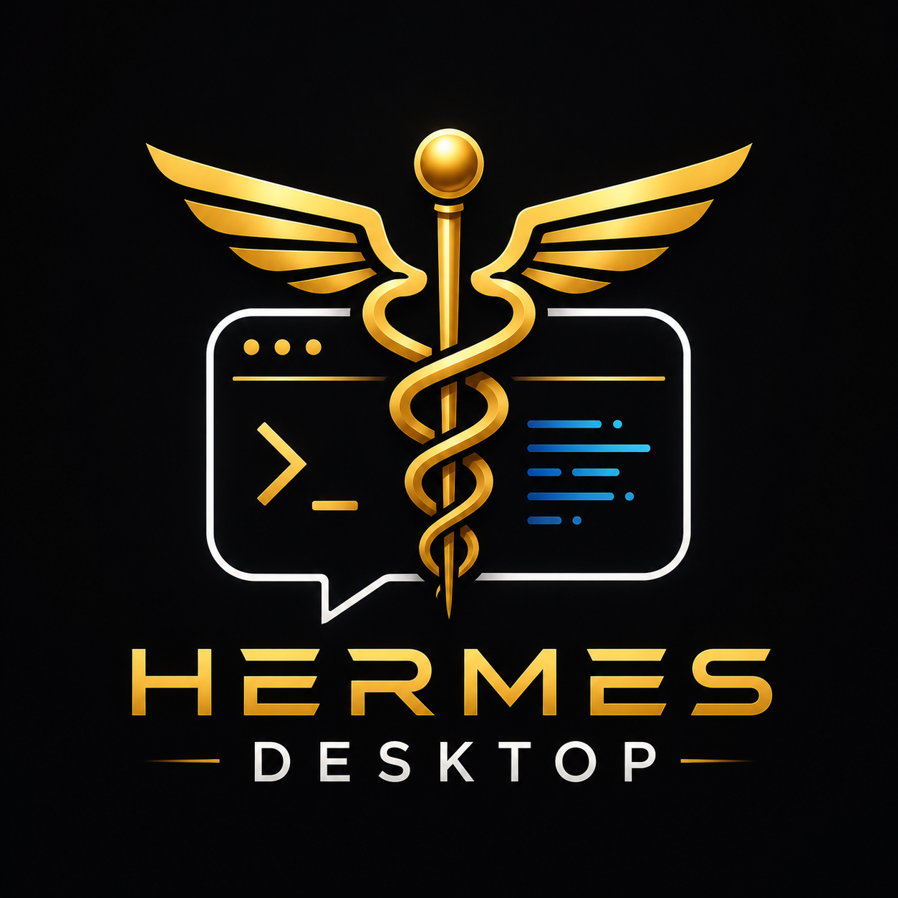

<p align="center">
  
</p>

<h1 align="center">Hermes Desktop</h1>

<p align="center">
  <em>A native desktop UI for the Hermes Agent — the self-improving AI agent from Nous Research.</em>
</p>

<p align="center">
  <a href="#features">Features</a> •
  <a href="#install">Install</a> •
  <a href="#usage">Usage</a> •
  <a href="#credits">Credits</a>
</p>

---

Stop juggling terminals. Talk to your AI, see what it's doing, browse files, run commands, and hear it speak back — all in one native window. Same agent, same skills, same memory as the CLI — just a lot prettier.

---

## Features

| | |
|---|---|
| **Full agent chat** | Streaming responses, live tool activity, structured summaries, full conversation history. |
| **Side-by-side previews** | Render web pages, files, and tool outputs in a right-hand pane while you keep chatting. |
| **File browser** | Explore and preview the working directory without leaving the app. |
| **Terminal** | Built-in xterm terminal for direct shell access. |
| **Voice** | Talk to Hermes and hear it speak back (mic + TTS). |
| **Settings UI** | Manage providers, models, tools, API keys, and credentials from a real interface. |
| **Onboarding** | First-run setup walks you through picking a provider and model in seconds. |
| **Messaging gateway** | Start Telegram, Discord, Slack, WhatsApp, and Signal from the desktop UI. |
| **Cron jobs** | Schedule recurring tasks with delivery to any platform. |
| **Auto-update** | Built-in updates pull the latest agent and rebuild in place. |
| **Cross-platform** | macOS, Windows, and Linux. |

---

## Install

### Step-by-step

The Hermes Agent source is included as a **git submodule** inside this repo, pinned to the exact version this desktop app was tested with. You get everything in one clone.

```bash
# 1. Clone the repo with the submodule
git clone --recurse-submodules https://github.com/ilan4ever/hermes-desktop.git
cd hermes-desktop

# 2. Install the Hermes CLI from the pinned submodule
#    macOS / Linux:
bash hermes-agent/scripts/install.sh
#    Windows (PowerShell):
# .\hermes-agent\scripts\install.ps1

# 3. Install desktop dependencies
npm install

# 4. Launch
npm run dev
```

The desktop app shares the same config, API keys, sessions, and skills as the CLI — nothing extra to configure.

> **Windows:** The Hermes CLI requires WSL2. The desktop app itself runs natively on Windows.

### Already have Hermes CLI?

You can also launch the desktop directly from the Hermes CLI itself:

```bash
hermes desktop
```

The app builds itself (Electron + React) on first run and launches. Pick a provider and model to get started.

### Windows — one-command runner

A PowerShell script is included that kills any previous instance and starts fresh:

```powershell
.\run.ps1
```

Each time you run it, it stops the old Hermes Desktop process and launches a new one. Add the `-Build` flag to build for production first:

```powershell
.\run.ps1 -Build
```

---

## Usage

1. **Clone + install** (see above).
2. **Run** `npm run dev` from the cloned repo, or `hermes desktop`.
3. **Pick** a provider (e.g. OpenRouter) and a model.
4. **Start chatting** — type a message and watch the agent work.

Slash commands like `/model`, `/compress`, `/skills`, and `/personality` all work in the desktop UI too.

### Useful flags

```bash
HERMES_DESKTOP_HERMES_ROOT=/path/to/hermes-agent npm run dev   # Point at a specific agent checkout
HERMES_HOME=/tmp/throwaway npm run dev                          # Sandbox config away from your real one
npm run dev:fake-boot                                            # Exercise the startup overlay
```

### Building installers

```bash
npm run dist:mac       # DMG + zip
npm run dist:win       # NSIS + MSI
npm run dist:linux     # AppImage + deb + rpm
npm run pack           # Unpacked app (no installer)
```

### Verify before a PR

```bash
npm run fix && npm run type-check && npm run lint && npm run test:desktop:all
```

---

## Updating the Hermes agent

The submodule is pinned to a specific commit. To update to a newer Hermes version:

```bash
cd hermes-agent
git fetch origin
git checkout origin/main
cd ..
git add hermes-agent
git commit -m "Bump Hermes agent to <describe change>"
```

Always test that the desktop app works before pushing a submodule bump.

Always test that the desktop app works before pushing a submodule bump.

---

## Troubleshooting

Boot logs are at `HERMES_HOME/logs/desktop.log` — check there first if the app fails to start.

**macOS / Linux:**

```bash
rm "$HOME/.hermes/hermes-agent/.hermes-bootstrap-complete"     # Force clean re-setup
rm -rf "$HOME/.hermes/hermes-agent/venv"                        # Rebuild Python venv
tccutil reset Microphone com.nousresearch.hermes                 # Reset mic permission
```

**Windows (PowerShell):**

```powershell
Remove-Item "$env:LOCALAPPDATA\hermes\hermes-agent\.hermes-bootstrap-complete"
Remove-Item -Recurse -Force "$env:LOCALAPPDATA\hermes\hermes-agent\venv"
```

---

## How It Works

The packaged app ships only the Electron shell. On first launch it installs the Hermes Agent runtime into `HERMES_HOME` (`~/.hermes`, or `%LOCALAPPDATA%\hermes` on Windows) — the same layout a CLI install uses. The React renderer talks to the Hermes Python backend over the standard gateway APIs and reuses the embedded TUI.

---

## Credits

Built and maintained by **ILAN AVIV**. This desktop app is a native UI wrapper around the [Hermes Agent](https://github.com/NousResearch/hermes-agent) by [Nous Research](https://nousresearch.com).

For inquiries, feedback, or collaboration: [onevoiceai.in/contact](https://onevoiceai.in/contact/)

---

## License

MIT — see [LICENSE](LICENSE).
